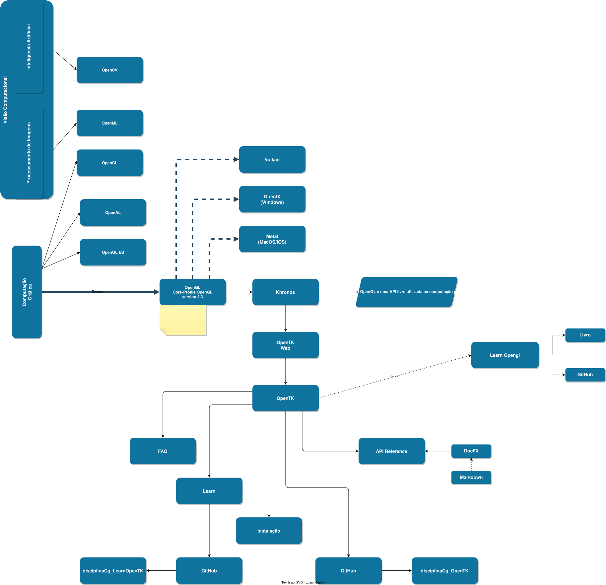

# Disciplina de Computação Gráfica  

[disciplina_CG_aulas_FreeForm]: <https://www.icloud.com/freeform/0c4lo1IrJ_sqr9iG5QdX-cyNg#disciplina_CG_aulas> "disciplina_CG_aulas_Freeform"  
[Cronograma]: <./cronograma.md> "Cronograma"  

Professor Dalton
<https://github.com/dalton-reis/dalton-reis>

## Material da disciplina de Computação Gráfica  

Faça o seu trabalho; cópias receberão nota zero. O professor pode a qualquer momento questionar e avaliar o trabalho desenvolvido. O aluno deve demonstrar conhecimento do código implementado respondendo principalmente a questões relacionadas ao conteúdo apresentado (a resposta deve ser do aluno, não de uma assistente de IA), e não apenas saber "ler" o código desenvolvido.  

O GitHub de cada equipe será criado pelo professor após a definição das equipes. Então, não esqueça de definir a sua equipe usando o **Equipes no AVA**, na qual somente um aluno da equipe posta o **nome completo** dos integrantes e os **usuários do GitHub**. Aconselha-se fortemente manter os integrantes que compõem a equipe até o final do semestre.  

Todos os trabalhos serão desenvolvidos em equipe (**máximo de quatro alunos**) e devem ser postados no GitHub até a data definida no [cronograma](cronograma.md "cronograma").  

## Referências bibliográficas

[https://www.zotero.org/groups/daltonreis_cg](https://www.zotero.org/groups/daltonreis_cg)  

## Rabiscos

Vocês irão notar que, quando preciso fazer algum rabisco, eu uso o FreeForm: [disciplina_CG_aulas_FreeForm]

## [Matriz curricular BCC](<https://github.com/dalton-reis/dalton-reis/blob/main/_._/matriz_BCC.pdf> "Matriz curricular BCC")  

## Plano de Ensino: ver no AVA

## [Cronograma]  

## Unidades

[Unidade 1](Unidade1 "Unidade 1")  
[Unidade 2](Unidade2 "Unidade 2")  
[Unidade 3](Unidade3 "Unidade 3")  
[Unidade 4](Unidade4 "Unidade 4")  

## [VisEdu-CG](https://gcgfurb.github.io/yoda/ "VisEdu-CG")

## Visão Geral

  
