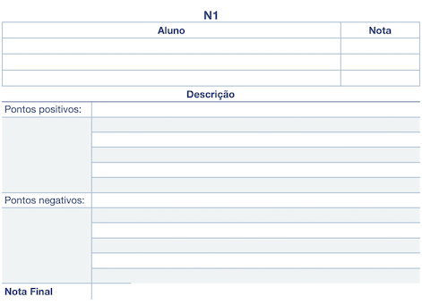

# Unidade 1: Introdução - atividade

Os assuntos serão sorteados pelo professor e enviados para cada equipe, então não esqueça de definir sua equipe no **Equipes no AVA**.

O que deve ser feito:

- prepare uma apresentação de no máximo 10 minutos;
- escolha a melhor forma de apresentar o conteúdo usando slides, animações, vídeos, exemplos práticos etc.;
- em caso de dúvida, converse com o professor.

<!-- 
## Assuntos

### Opção A

**Animação**  
**Percepção Visual**  
**Digitalizador 3D (scanner)**  
Os assuntos de Animação e Percepção Visual têm uma relação entre si. Sugiro que apresentem o assunto Animação e, depois, ao apresentarem Percepção Visual, façam a relação com Animação. Há um TCC que orientei há bastante tempo (20 anos) sobre animação (orientanda Marlise Frotscher Milbratz).  
O hardware Digitalizador 3D (scanner) envolve qualquer equipamento que capture uma nuvem de pontos, podendo variar desde equipamentos médicos (por exemplo, ressonância magnética) e equipamentos utilizados na produção de animações de personagens (motion capture) até sensores mais “domésticos”, como o sensor do Kinect (por exemplo, o Azure Kinect DK).  

### Opção B

**Modelagem Geométrica / Geometria Computacional**  
**Visualização Científica**  
**Placas Gráficas**  
O assunto Modelagem Geométrica recebe vários nomes na literatura, mas basicamente é uma junção do uso da matemática, de estruturas de dados e de grafos para auxiliar a Computação Gráfica na resolução de problemas geométricos. Uma biblioteca muito conhecida (por ser de código aberto) é a [CGAL](https://www.cgal.org). Há também muitas bibliotecas gráficas ou mesmo bibliotecas de "números complexos" que implementam algoritmos de Modelagem Geométrica.  
Já o assunto de Visualização Científica geralmente trata de uma grande quantidade de valores (dados) que devem ter um limite mínimo de precisão/exatidão aceitável. A Visualização Científica auxilia em problemas inerentes às áreas da medicina, química, aerodinâmica, dinâmica de fluidos etc. Há um TCC que coorientei há bastante tempo (21 anos) sobre Visualização Científica (orientando George Ruberti Piva, prof. de dinâmica de fluidos da FURB, Henry França Meier).  
As placas gráficas utilizadas no processo de renderização também auxiliam muito essas duas áreas, principalmente a Visualização Científica, pois permitem acelerar o processo de cálculo exigido para a renderização final. Outra característica importante a explorar é a configuração das placas mais modernas e seu custo.  

### Opção C

**Interface Humano-Computador**  
**Interface de Usuário Tangível (IUT)**  
**Acelerômetro**  
O assunto Interface Humano-Computador tem uma relação forte com a área gráfica porque se beneficia muito dos recursos de interface gráfica disponíveis atualmente. Acho que podem comentar brevemente sobre Interface Humano-Computador e, então, explicar Interface de Usuário Tangível (IUT), que tem uma relação ainda maior com a área gráfica. Ela auxilia o desenvolvimento de produtos que, por exemplo, são usados em Realidade Virtual.  
O nosso grupo de pesquisa já fez alguns trabalhos explorando o uso de IUT. Um deles está em <http://caixae-agua.blogspot.com/>. Há também alguns TCCs que usaram esta abordagem, como o do orientando Flávio Omar Losada. Ele construiu um aquário virtual. Se quiserem mostrá-lo na apresentação, avisem-me durante a apresentação, pois ele está aqui comigo.  
O hardware gráfico acelerômetro pode auxiliar no desenvolvimento de IUT.  

### Opção D

**Sistemas Multimídia**  
**AutoCAD**  
**Tinkercad**  
**SketchUp**  
O assunto Sistemas Multimídia é como se fosse uma "provedora" de recursos para a área gráfica. Ela pesquisa o melhor uso de recursos do tipo imagem, áudio, vídeo e streaming. Com o constante avanço do hardware, aumenta-se a complexidade desses recursos, gerando variações em arquivos do tipo DICOM e Street View ou mesmo a renderização de mapas 3D inteiros de cidades (por exemplo, os mapas da Apple). Já orientei TCCs relacionados com esse assunto, como o do orientando Jorge Luis Iten Júnior.  
Já os softwares AutoCAD, Tinkercad e SketchUp são ferramentas que podem gerar esses tipos de recursos gráficos.  
-->

## Gabarito

  

----------

## ⏭ [Unidade 2](../Unidade2/README.md "Unidade 2")  
