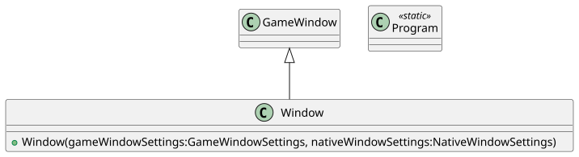
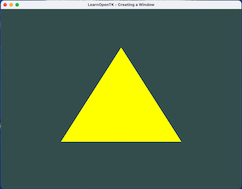
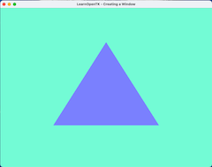
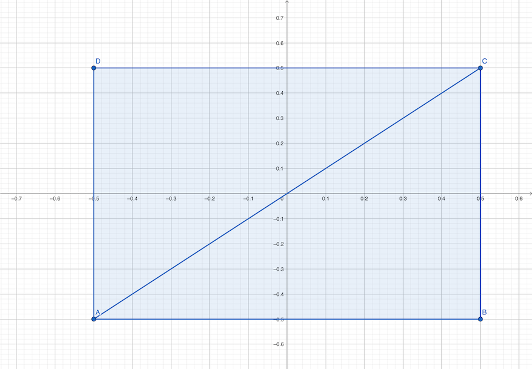

# Unidade 2 - OpenTK: Testar Ambiente

Para desenvolver as atividades abaixo primeiro precisa ter o [Ambiente de Desenvolvimento](../AmbienteDesenvolvimento.md "Ambiente de Desenvolvimento") instalado.  

## 1-CreatingAWindow

Cria uma janela usando o OpenTK.  
Ver a pasta: [1-CreatingAWindow](./Chapter1/1-CreatingAWindow/)  
Este projeto usar a definição de Shaders: [./Common](./Common/)  

Diagrama de Classes:  
  

## 2-HelloTriangle

Exibe a representação de um triângulo usando OpenTK.  
Ver a pasta: [2-HelloTriangle](./Chapter1/2-HelloTriangle)  
Este projeto usar a definição de Shaders: [./Common](./Common)  

Diagrama de Classes:  
  

## Atividade de Teste

Usando o fonte do projeto: **2-HelloTriangle** faça.

### Exercício A

- Mudar a cor  
  fundo:  
    R: 115      <!-- 115/256 = 0.44921875 -->
    G: 252      <!-- 252/256 = 0.98437500 -->
    B: 214      <!-- 214/256 = 0.83593750 -->
  triângulo:  
    R: 122      <!-- 122/256 = 0.47656250 -->  
    G: 129      <!-- 129/256 = 0.50390625 -->
    B: 255      <!-- 255/256 = 0.99609375 -->

Antes - Depois  
   

### Exercício B

- Desenhar um quadrado em vez de um triângulo usando os pontos abaixo:  
<https://www.geogebra.org/geometry/ef2ghh35>  
  

----------

## ⏭ [Unidade 2](../../Unidade2/README.md "Unidade 2")  
