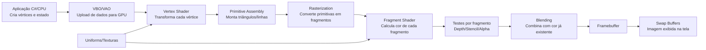
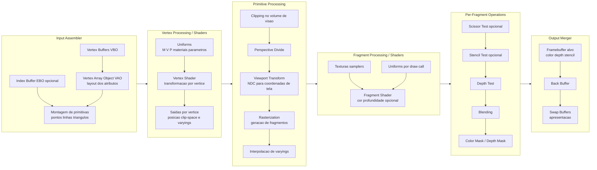
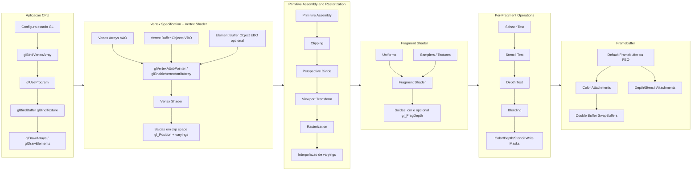

# Computação Gráfica - Unidade 2  

Conceitos básicos de Computação Gráfica: estruturas de dados para geometria, sistemas de coordenadas na biblioteca gráfica (OpenGL/OpenTK), primitivas básicas (vértices, linhas, polígonos, círculos e curvas cúbicas – splines).  
Objetivo: aplicar os conceitos básicos de sistemas de referências e modelagem geométrica em Computação Gráfica.  

## Ambiente de Desenvolvimento

Para iniciar as atividades precisamos configurar o [Ambiente de Desenvolvimento](AmbienteDesenvolvimento.md "Ambiente de Desenvolvimento")  
Agora que já temos o [Ambiente de Desenvolvimento](AmbienteDesenvolvimento.md "Ambiente de Desenvolvimento") instalado vamos testá-lo usando alguns projetos de exemplo.  

<!-- ## [Atividades - Aula](Atividade2/README.md "Atividades - Aula")   -->

## Conteúdo

<!-- [cg-slides_u2.pdf](./cg-slides_u2.pdf "cg-slides_u2.pdf")  
[anotações do quadro](aulaAnotacoesQuadro)   -->

### OpenGL - Pipeline Gráfico: Visão geral

#### Visão detalhada por etapas

#### Visão detalhada por etapas - sem DirectX

----------

## ⏭ [Unidade 3](../Unidade3/README.md "Unidade 3")  

## Principais Referências Bibliográficas​

O material utilizado nesta disciplina é baseado nessas Referências Bibliográficas​.  

### Links OpenGL

- OpenGL: <https://en.wikipedia.org/wiki/OpenGL>  
- OpenGL (aprendendo): <https://learnopengl.com/>  
- OpenGL (aprendendo, livro): <https://learnopengl.com/book/book_pdf.pdf>
- OpenGL (aprendendo, GitHub): <https://github.com/JoeyDeVries/LearnOpenGL>  
- Khronos: <https://www.khronos.org/api/opengl>  

### Links OpenTK

- OpenTK: <https://opentk.net/>  
- OpenTK GitHub: <https://github.com/opentk>  
- OpenTK FAQ: <https://opentk.net/faq.html>  
- OpenTK FAQ (usando OpenTK): <https://opentk.net/faq.html#installing-and-using-opentk>  
- OpenTK (aprendendo): <https://opentk.net/learn/index.html>  
- OpenTK (aprendendo, GitHub): <https://github.com/opentk/LearnOpenTK>  
- OpenTK (API): <https://opentk.net/api/index.html>  

### Links OpenTK fontes

- OpenTK (fontes, não usar): <https://github.com/opentk/opentk>  

### Links IDE VSCode

<https://github.com/LDTTFURB/site/tree/main/ProjetosEnsino/Topicos/VSCode>  

### Links C\#

<https://github.com/LDTTFURB/site/tree/main/ProjetosEnsino/Topicos/CSharp>  
